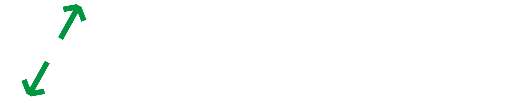

<p align="center">
    
</p>

<br/>

Welcome to the official landing page for **OpenSourceNest** — a beginner-friendly open source initiative promoting inclusion, collaboration, and digital empowerment through learning and advocacy.

## 🚀 Overview

OpenSourceNest is dedicated to helping everyday people learn, use, and contribute to open source. Our platform showcases community-led projects, campaigns, workshops, and events designed to empower individuals with the skills and knowledge needed to thrive in the open source ecosystem.

## 🌟 Features

- **Campaign Timeline:** Stay updated with our ongoing and upcoming open source campaigns and workshops.
- **Projects Showcase:** Explore a variety of community-driven projects and learn how you can contribute.
- **Events & Workshops:** Participate in monthly workshops, in-person events, and AMAs.
- **Community Engagement:** Join Africa’s most vibrant open source community via WhatsApp, Discord, and more.
- **Responsive Design:** Fully responsive and accessible across devices.
- **Modern Stack:** Built with Next.js, React 19, Tailwind CSS, and Framer Motion for smooth animations.

## 🖥️ Tech Stack

- [Next.js](https://nextjs.org/) (App Router)
- [React 19](https://react.dev/)
- [Tailwind CSS](https://tailwindcss.com/)
- [Framer Motion](https://www.framer.com/motion/)
- [TypeScript](https://www.typescriptlang.org/)

## 📦 Getting Started

### Prerequisites

- Node.js (v18+ recommended)
- npm or yarn

### Installation

1. **Clone the repository:**

   ```sh
   git clone https://github.com/your-username/open-source-nest-landing-page.git
   cd open-source-nest-landing-page
   ```

2. **Install dependencies:**

   ```sh
   npm install
   # or
   yarn install
   ```

3. **Run the development server:**

   ```sh
   npm run dev
   # or
   yarn dev
   ```

4. Open [http://localhost:3000](http://localhost:3000) in your browser.

### Building for Production

```sh
npm run build
npm start
```

## 🗂️ Project Structure

```
src/
  app/                # Next.js app directory (pages, layouts)
  components/         # Reusable React components
  data/               # Static data (projects, campaigns)
  font/               # Custom font definitions
  utils/              # Utility functions and templates
public/               # Static assets (images, fonts)
```

## ✨ Contributing

We welcome contributions of all kinds! Please read our [CONTRIBUTING.MD](./CONTRIBUTING.MD) for guidelines on how to get started.

## 📄 License

This project is open source and available under the [MIT License](./LICENCE.md) (add a LICENSE file if not present).

## 📬 Contact

- Email: [info@opensourcenest.org](mailto:info@opensourcenest.org)
- [LinkedIn](https://www.linkedin.com/company/opensourcenest)
- [X (Twitter)](https://x.com/opensourcenest)
- [Discord](https://bit.ly/osn-discord)
- [WhatsApp](https://bit.ly/osn-whatsapp)

---

**Join us and start making an impact today!**
